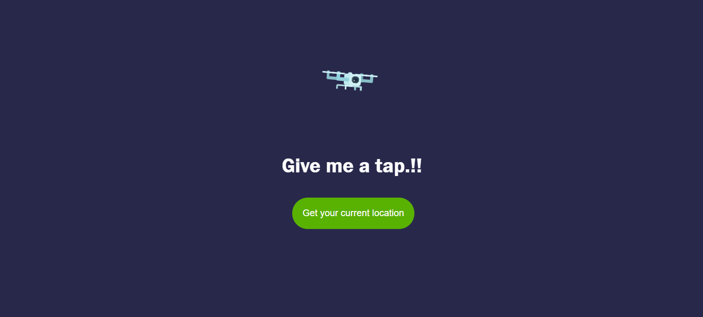
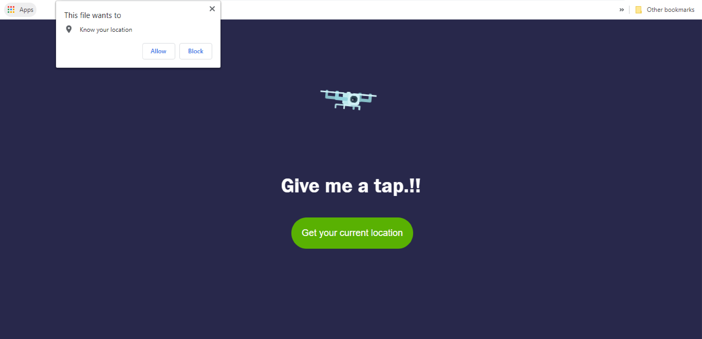
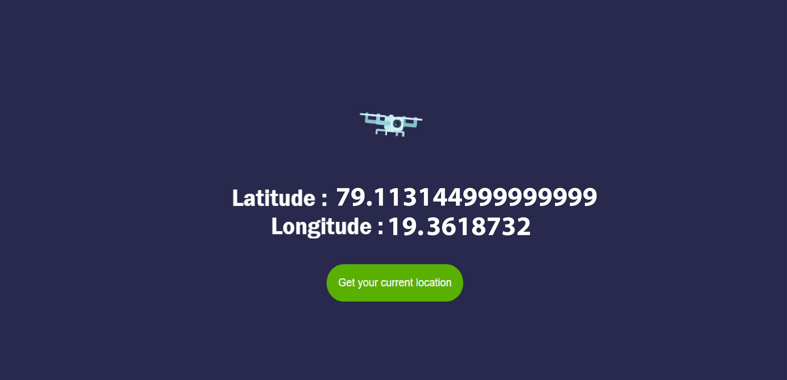

# Track-My-Location
See your current location by using latitude and longitude  

💻😍 Online Demo : https://track-my-location-with-js.netlify.app/

### Table of Content
-01 [What is this?](#What) 
-02 [For why?](#why) 
-03 [What are the technologies used?](#technologies) 
-04 [How to used this?](#How) 
-05 [Drone animation copyrights](#Drone) 

## What is this?<a name="What"/>
This is a simple location tracker. In this app I'm using JavaScripts to get user current location. 

## For why?<a name="why"/>
Just simple..!! You can get your current location from latitude and longitude. 

## What are the technologies used?<a name="technologies"/>
- HTML
- CSS
- JavaScript

## How to use this?<a name="How"/>

First click the **Get your current location** button. 

**Allow** the permission to get your location. 

Then **latitude and longitude** will display on the screen. 

## Drone animation copyrights<a name="Drone"/>
Drone animation fully copyrights goes to **Ivan Odintsov** from CodePen. (https://codepen.io/infinitemonkeys/pen/NWrLymb) 
Original by **Gal Shir** (https://dribbble.com/shots/3407631-Drone). 
Thank you sooo much for the creative animation design.❤️❤️
